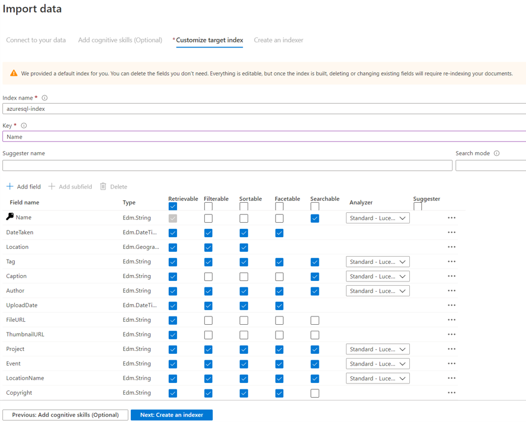
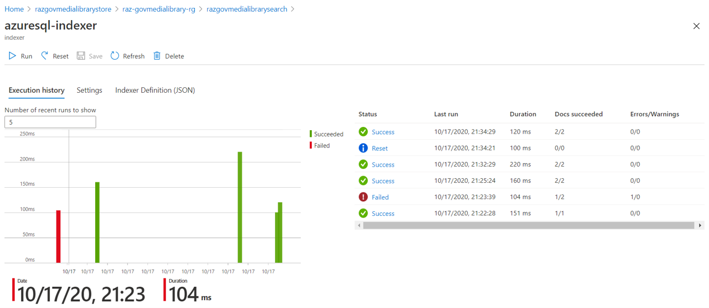

# Steps to configure Azure Search

Azure Search supports multiple data sources such as Azure SQL Database, SQL Server, Cosmos DB, Azure Blob Storage, Azure Data Lake Storage Gen2 and Azure Table Storage.

## Step 1 - Import Data
To create a search indexer based on the data source, first navigate to **Import data** on top panel. Depending on data source, please establish the connection accordingly.

For example, if you are configuring Azure SQL as data source, you will need to provide database connection and SQL credential. On the other hand, if you are configuring blob storage, you have the option to select data to extract, and what is the parsing mode (Text, JSON, Delimited text etc).

## Step 2 - Add cognitive skills (Optional)
Azure Search has tight integration to [Azure Cognitive Services](https://docs.microsoft.com/en-us/azure/cognitive-services/text-analytics/), especially on text analytics. This step is optional, depending on what additional information is required to be derived, such as extract personally identifiable information, detect location etc. These *Text Cognitive Skills* is completely optional, and developer can choose to develop custom cognitive skills as well.

Once done, click next.

## Step 3 - Customize Index
This step is important in Azure Search, which will impact the search results. There are 5 properties for each object, namely *Retrievable*, *Filterable*, *Sortable*, *Facetable* and *Searchable*. Developer needs to decide accordingly for each field, as this will impact the search results. For instance, in this project, we have **Tag**, which is meant to searchable, and facetable, hence we can select this.

For another example, say URL. We don't need this URL to be searchable, filterable, sortable or even facetable, hence we just need to select *Retrievable*.

Besides deciding these 5 properties for each field, be mindful on the **Type** column as well. This is equivalent to variable type in coding, and by default, Azure Search will generate the data type after assessing the sample data. Be mindful and do a quick check, especially data with date time, and geography point.

One last thing is to give your index a name, and select appropriate column as key. Once done, click **Next* to proceed.

## Step 4 - Create Indexer
In this last step, you can select the schedule to re-index Azure Search, from daily to hourly, or with custom timeframe as required. Note that the minimum frequency that you can set in the portal is 5 minutes. You can use [SDK](https://docs.microsoft.com/en-us/rest/api/searchservice/indexer-operations) to trigger on-demand re-indexing as needed.

# Outcome
Once done, you can check indexer status in Azure portal, simply navigate to Overview tab of Azure Search, and look for **Indexer** at bottom. 

The following shows a sample. It will list down the error message if there's any particular file or entries is not able to index.

In the same overview page, if you navigate to **Indexes**, you can test the search query in portal to validate the setup.