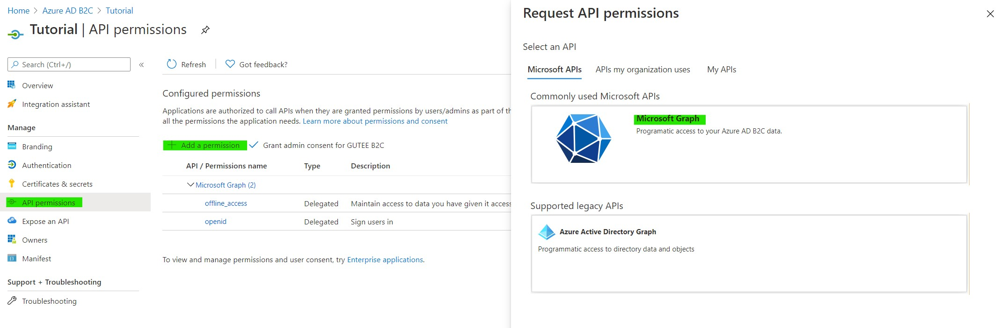
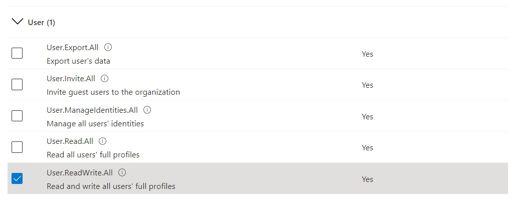
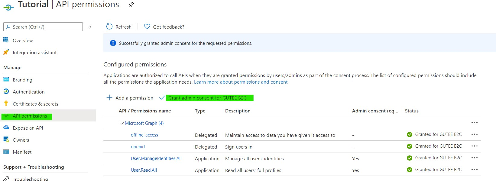

# Use Azure AD B2C API (Microsoft Graph)

Microsoft Graph is a collection of APIs to interact with Azure Active Directory and Azure Active Directory B2C. Two modes are supported, which is interaction on behalf of users (which requires user to sign in), or application interact with Microsoft Graph directly.

In this case, we are focusing on application interact with Microsoft Graph directly, as this is admin function and no users sign in is required.

## Authentication Flow
First the application is registered under Azure Active Directory B2C as an enterprise application, and this registration will provides client ID and secret. Using REST api, developers can use this information to obtain bearer token, which is then be used in all api operation, as documented here: [Microsoft Graph Documentation](https://docs.microsoft.com/en-us/graph/overview?view=graph-rest-beta).

### Step 1: App Registration
Navigate to Azure AD B2C portal, under App Registration, click "+ New registration".


Give it a name, and choose "Accounts in this organizational directory only" under **Supported account types**. We can ignore Redirect URI for the time being as there's no user login and no website to redirect to.

### Step 2: Grant API permissions
In this section, we need to manage users using this application, hence we need to grant necessary permissions.



Under type of permissions, choose **Application permissions** as we are going to run this app without user sign in. We need __User.ReadWrite.All__ permission to get user details.



Once done, navigate to **API Permissions** on left panel, and click "Grant admin content" to grant necessary rights to this application.



Once done, generate secrets for this application to enable authentication at later stage. Navigate to **Certificates & secrets** on left panel, and click "+ New client secret". Store this secret as we need this for authentication later.

Lastly, navigate to **Overview** and copy **Application (client) ID**, **Directory (tenant) ID**. Together with secret above, this is required for authentication via REST api.

### Step 2: Obtain authentication token
To obtain token, simply do a POST action with following info:

```
POST https://login.microsoftonline.com/{{Directory (tenant) ID}}/oauth2/v2.0/token
Content-Type: application/x-www-form-urlencoded

grant_type: client_credentials
client_id: {{Application (client) ID}}
client_secret: {{Client secrets generated above}}
scope: https://graph.microsoft.com/.default
```

Replace __{{double curley bracket}}__ with the information obtained above. If the request is successful, you will obtain an access token, which can be used for subsequent actions.

### Step 3: Get user details
With token obtained above, we can obtain the list of users by using the following API and access token obtained:

```
GET https://graph.microsoft.com/v1.0/users
Authorization: Bearer {{access_token obtained above}}
```

Here's a sample reponse:
```json
{
  "@odata.context": "https://graph.microsoft.com/v1.0/$metadata#users",
  "value": [
    {
      "businessPhones": [],
      "displayName": "test",
      "givenName": "test",
      "jobTitle": null,
      "mail": null,
      "mobilePhone": null,
      "officeLocation": null,
      "preferredLanguage": null,
      "surname": "test",
      "userPrincipalName": "test@guteeb2c.onmicrosoft.com",
      "id": "00000000-0000-0000-0000-000000000000"
    }
  ]
}
```
We need **id**, which represents user GUID registered under this Azure AD. 

### Step 4: Delete user
To delete user, simply use the following api:

```
DELETE https://graph.microsoft.com/v1.0/users/{{user-id}}
Authorization: Bearer {{access_token obtained above}}
```

We will receive 204 response if it's successful.

A sample API request can be found in rest.http (using VS Code Rest Client extension).

### Extra
We can also use Microsoft Graph to obtain user sign in logs for entire Azure Active Directory. Permission required is **AuditLog.Read.All** under app registration, and we can then use this to analyze sign in behavior and remove users if they didn't sign in for more than x days.

Use the following API:
```
GET https://graph.microsoft.com/v1.0/auditLogs/signIns
Authorization: Bearer {{access_token obtained above}}
```

Here's sameple response:

```json
{
  "@odata.context": "https://graph.microsoft.com/v1.0/$metadata#auditLogs/signIns",
  "value": [
    {
      "id": "00000000-0000-0000-0000-000000000000",
      "createdDateTime": "2021-01-01T07:04:35Z",
      "userDisplayName": "abc@xyz.com User",
      "userPrincipalName": "abc@xyz.com",
      "userId": "00000000-0000-0000-0000-000000000000",
      "appId": "00000000-0000-0000-0000-000000000000",
      "appDisplayName": "Azure Portal",
      "ipAddress": "1.1.1.1",
      "clientAppUsed": "Browser",
      "correlationId": "00000000-0000-0000-0000-000000000000",
      "conditionalAccessStatus": "notApplied",
      "isInteractive": false,
      "riskDetail": "hidden",
      "riskLevelAggregated": "hidden",
      "riskLevelDuringSignIn": "hidden",
      "riskState": "none",
      "riskEventTypes": [],
      "riskEventTypes_v2": [],
      "resourceDisplayName": "Windows Azure Service Management API",
      "resourceId": "00000000-0000-0000-0000-000000000000",
      "status": {
        "errorCode": 0,
        "failureReason": "Other.",
        "additionalDetails": "MFA requirement satisfied by claim in the token"
      },
      "deviceDetail": {
        "deviceId": "",
        "displayName": "",
        "operatingSystem": "Windows 10",
        "browser": "Edge 89.0.749",
        "isCompliant": false,
        "isManaged": false,
        "trustType": ""
      },
      "location": {
        "city": "Tanglin",
        "state": "South West",
        "countryOrRegion": "SG",
        "geoCoordinates": {
          "altitude": null,
          "latitude": 1.11,
          "longitude": 101.111
        }
      },
      "appliedConditionalAccessPolicies": []
    }
  ]
}
```